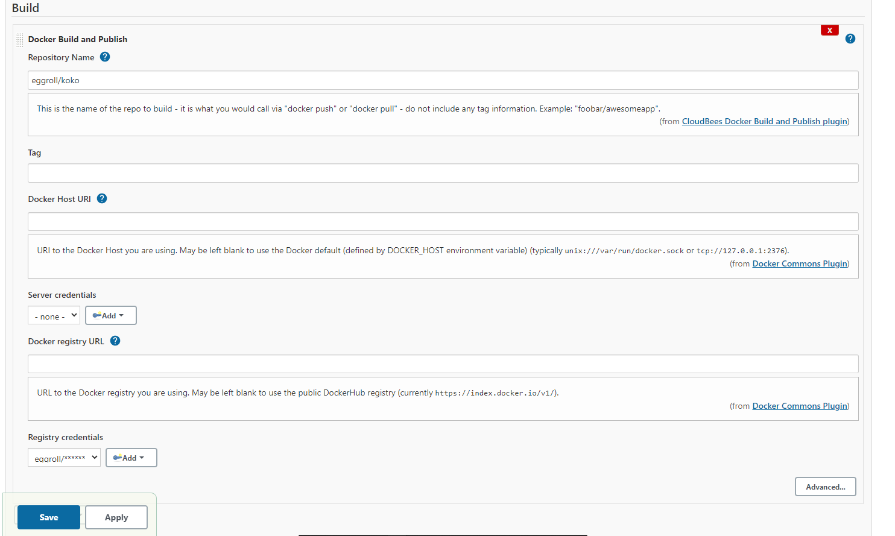

# Docker image deployment, using ansible

Using terraform to provision AWS resources, and deploy a simple flask app using ansible.

# TOC

- [Docker image deployment, using ansible](#docker-image-deployment--using-ansible)
- [Getting started](#getting-started)
- [Dependencies](#dependencies)
- [Docker image](#docker-image)
- [AWS resource provisioning](#aws-resource-provisioning)
- [Ansible](#ansible)
- [Jenkins](#jenkins)
- [Jenkins & Ansible](#jenkins---ansible)

# Getting started

The project is broken down into:

- Buld docker image and push to docker hub
- Provision AWS resources using terraform
- Use ansible to install docker in the ec2 instances and run the image pulled from docker hub
- Setup jenkins to build and push new containers to docker hub and deploy to the instances

# Dependencies

To set up your environment to run the code in this repository, you need to have terraform, ansible and jenkins installed.

Installation links:

- Terraform https://www.terraform.io/downloads
- Ansible https://docs.ansible.com/ansible/latest/installation_guide/index.html

# Docker image

1. Login to docker hub

Or any other registry of choice

Build the docker image, tag and push to the registry. This is the image to be deployed using ansible.

```bash
docker login
```

# AWS resource provisioning

1. Clone the repository and navigate to the terraform folder

```bash
# clone the repository
git clone https://github.com/mrdvince/koko.git

# the terraform directory
cd iac-modules/terraform
```

> for convinience using terraform login it using the `aws cli` this way you don't have to provide the aws access keys to terraform

```bash
# will walk you through the steps of setting it up
aws configure
```

2. Setup

- EC2 instances
  The current configuration is set up to create 2 instances with the ability to scale up to a max of 3 instaces if there's a sustained cpu load above 20% for 2 minutes.

These should be modified to suit you needs (e.g 20% load is not much, increase it to around 90%)

- Load balancing

A load balancer is also configured to include the instances and route traffic accordingly to them

the load balancer and the instances use separate AWS security groups so feel free to play around with that as well

3. Terraform apply

Once satisfied with the config, run `terraform apply` to create all the resources and in about 4mins everything should be set up

Test the instance by trying to ssh using your ssh key.

```bash
# check the changes terraform is going to make
terraform plan
# apply the config
terraform apply

# try to ssh to the instance
ssh -i <your key here> ubuntu@<instance ip>
```

You can also check the aws console to verify if everything is setup correctly

# Ansible

Inside the ansible directory there are two playbooks, one for installing docker and the other deploys the application.

1. Update the inventory

The file has a list of instance, this is the list ansible is going to use to deploy the image.

2. Ping the instances

Check if ansible can communicate with the instances.

```bash
 ansible all -m ping
```

3.  Install docker

Run the install docker playbook, this will go ahead and install docker in all the instances in the inventory list

```bash
ansible-playbook playbooks/install-docker.yaml
```

4.  Deploy the app

Run the `deploy_app.yaml` playbook to pull the image from docker hub and deploy it to all the instances.

> Since the instances are behind a load balancer this will take care of routing the traffic to them.

```bash
ansible-playbook playbooks/deploy_app.yaml
```

> visit the load balancer's dns name, should have been printed to the screen when terraform finished running, alternatively this can be found on the console.

# Jenkins

1. Fetch the war file from jenkins website and run it

```bash
java -jar jenkins.war
```

Visit `http://localhost:8080/` and go through the initial setup guide, which entails creating a new user etc.

2. Install docker plugins

In order to be able to build the containers and push them to the registry a few extra set up steps are required.

Head over to `Manage Jenkins` then `Manage Plugins` under `available` search for docker and install

- Docker plugin
- Docker Pipeline
- CloudBees Docker Build and Publish plugin

this will add more options to the build steps in the project

3. New Item

- Go back to the dashboard and create a `New Item` and select `Freestyle project`
- Add a description of your choice (what the project is about)
- Select Github project option and provide the project url
- Under `Source Code Management` select git and provide the git url, (if it's a private github project credentials are also required)
- Next add a build step and select `Docker build and Publish` and fill the fields, docker hub credentials are also needed if using docker hub, if the fields are left empty the defaults are used. Attached screenshot.



- finally apply, save and build.

> Build Triggers can also be setup based on once's choice. I went with `Poll SCM` every minute `* * * * *`

# Jenkins & Ansible

WIP
